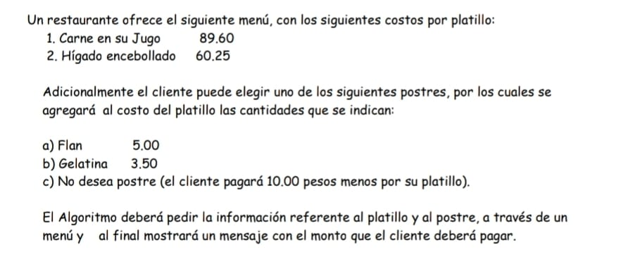

# Detalle del problema



Requerimientos:

* Python 3.7 or higher.

Para ejecutar los programas usa el siguiente comando en una `cmd` o `shell`.

```bash
python restaurant_pro.py
```

## Breve descripción del algoritmo

* Se usa diccionarios para almacenar los datos. Razón: Un diccionario permite almacenar un `key` y `values`. La *key* permite comprobar facilmente que la opción del menú elegido por el usuario es correcto, así como también permite acceder a sus respectivos *values*.
* Como `values` del diccionario se usa una `tuple` (tupla) que contiene en la *primera posición* el **nombre del plato del menu** y como *seunda posición* el **precio**. La tupla no muta por lo tanto es la elegida para evitar que los datos sean alterados durante el proceso de ejecución del programa. La tupla se puede iterar tal cual una lista.

## Sobre las versiones: **restaurant_simple.py** y **restaurant_pro.py**

* La versión ***restaurant_simple.py*** no tiene en cuenta que el usuario pueda cometer errores. El programa falla si el usuario ingresa una opción que no se encuentra en el menú.
* La versión ***restaurant_pro.py*** usa un bucle `while` para asegurar que el usuario ingrese un valor válido para el programa. Evita que el programa falle si usuario ingresa información no válida.
