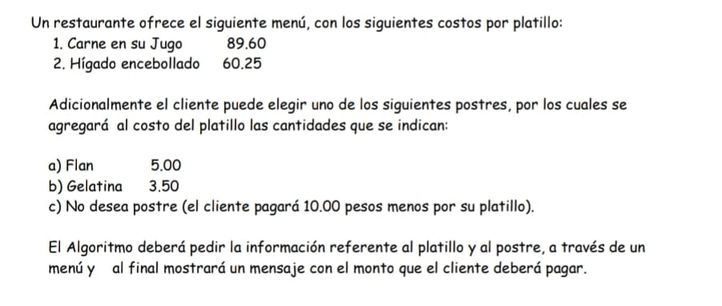

# Esta carpeta contiene la solución del siguiente problema:



Requerimientos: 

* Python 3.7 or higher.

Para ejecutar los programas usa el siguiente comando en una `cmd` o `shell`.

```bash
python restaurant_pro.py
```

## Breve descripción del algoritmo:

* Se usa diccionarios para almacenar los datos. Razón: permite almacenar un valor `key` para las entradas que usaremos para comprobar que menú ha elegido el usuario, además permite acceder a sus respectivos `values`.
* Como `values` del diccionario se usa una `tuple` (tupla) porque permite que los datos no sean alterados durante el proceso de ejecución del programa. La tupla se puede iterar de forma convencional.

## Sobre las versiones: **restaurant_simple.py** y **restaurant_pro.py**

* La versión ***restaurant_simple.py*** no tiene en cuenta que el usuario pueda cometer errores. El programa falla si el usuario ingresa una opción que no se encuentra en el menú.
* La versión ***restaurant_pro.py*** usa un bucle `while` para asegurar que el usuario ingrese un valor válido para el programa. Evita que el programa falle si usuario ingresa información no válida.